# Subscription Billing Engine — Microservices

<p>
  
  
  
  
  
</p>

A subscription billing platform built as nine Spring Boot microservices. It models the full lifecycle of a SaaS subscription — customer onboarding, plan subscription, payment processing through Stripe, PDF invoice generation and transactional email — coordinated asynchronously through **AWS SNS/SQS**. Each service owns its database, is discovered through **Eureka**, pulls configuration from a central **Config Server**, and reports metrics, logs and distributed traces through **OpenTelemetry**. The system is containerized and deployed to **AWS EC2** through per-service CI/CD pipelines.


## Table of Contents

- [Overview](#overview)
- [Architecture](#architecture)
- [Services](#services)
- [Event-Driven Communication](#event-driven-communication)
- [Subscription Lifecycle](#subscription-lifecycle)
- [End-to-End Flow](#end-to-end-flow)
- [Design Patterns](#design-patterns)
- [Tech Stack](#tech-stack)
- [Observability](#observability)
- [Screenshots — Stripe, Emails, Invoice](#screenshots--stripe-emails-invoice)
- [Running the Stack](#running-the-stack)
- [API Walkthrough](#api-walkthrough)
- [Testing Payments — Approved and Declined](#testing-payments--approved-and-declined)
- [CI/CD and Deployment](#cicd-and-deployment)
- [Repository Structure](#repository-structure)
- [Screenshot Checklist](#screenshot-checklist)
- [Roadmap](#roadmap)

* * *

## Overview

The system separates the concerns of a billing engine into independently deployable services. A customer signs up, subscribes to a plan, and the payment is processed by Stripe. The outcome of the payment then drives everything else — invoice generation, transactional email and subscription activation — asynchronously, with no service blocking on another.

Two properties shaped the design:

- **Isolation** — each service owns its data (a dedicated PostgreSQL database) and its deployment. There is no shared schema and no cross-service database access.
- **Asynchronous coordination** — services communicate through events (SNS topics fanning out to SQS queues), so the payment path, the invoicing path and the notification path proceed in parallel and independently.

* * *

## Architecture

All external traffic enters through a single **API Gateway**, which validates the JWT and routes to downstream services resolved by name through **Eureka**. On startup, every service registers with Eureka and fetches its configuration from the **Config Server**, which is backed by a separate Git repository. Synchronous service-to-service calls use **OpenFeign**; asynchronous coordination uses **SNS → SQS**.

| Concern | Implementation |
|---|---|
| Service discovery | Netflix Eureka (`eureka-service`, `:8761`) |
| Centralized configuration | Spring Cloud Config Server, Git-backed (`config-service`, `:8888`) |
| Edge / routing | Spring Cloud Gateway + OAuth2 Resource Server (`api-gateway`, `:8080`) |
| Synchronous calls | OpenFeign + internal-JWT request interceptor |
| Asynchronous events | AWS SNS → SQS fan-out (AWS SDK v2 + `spring-cloud-aws` `@SqsListener`) |
| Persistence | PostgreSQL per service (AWS RDS) + Flyway migrations |
| Payments | Stripe (`stripe-java`) + Stripe webhooks |
| Resilience | Resilience4j circuit breaker + retry (payment ↔ Stripe) |
| Observability | Micrometer + OpenTelemetry (OTLP) → Collector → Prometheus / Loki / Tempo → Grafana |

### C4 container diagram — Billing Engine:
<p align="center">
  
</p>

* * *

## Services

| Service | Port | Responsibility |
|---|---|---|
| `eureka-service` | `8761` | Service registry (Netflix Eureka) |
| `config-service` | `8888` | Centralized configuration server (Git-backed) |
| `api-gateway` | `8080` | Edge routing (Spring Cloud Gateway) + JWT validation |
| `authentication-service` | — | JWT issuance (HMAC256), user registration, internal service tokens |
| `customers-service` | — | Customer CRUD, Stripe customer creation |
| `subscription-service` | — | Plans, subscription lifecycle, Stripe subscription creation |
| `payment-service` | — | Stripe webhook handling, payment processing, event publishing |
| `invoice-service` | — | PDF invoice generation (openhtmltopdf) + S3 storage |
| `notification-service` | — | Transactional emails via AWS SES (HTML templates) |

Non-infrastructure services are not exposed directly; all traffic goes through the API Gateway on `:8080`.

* * *

## Event-Driven Communication

Asynchronous coordination is done through SNS topics that fan out to SQS queues. Producers publish JSON events with `SnsClient`; consumers read them with `@SqsListener`. An SQS message delivered from SNS arrives wrapped in an `SnsMessage` envelope — the actual event payload is in its `Message` field and is deserialized before handling.

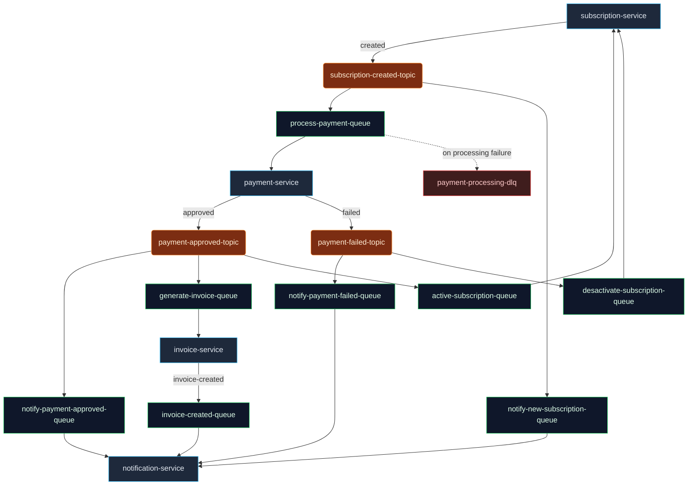

| Topic (SNS) | Published by | Subscribed queue → consumer |
|---|---|---|
| `subscription-created-topic` | subscription-service | `process-payment-queue` → payment · `notify-new-subscription-queue` → notification |
| `payment-approved-topic` | payment-service | `notify-payment-approved-queue` → notification · `generate-invoice-queue` → invoice · `active-subscription-queue` → subscription |
| `payment-failed-topic` | payment-service | `notify-payment-failed-queue` → notification · `desactivate-subscription-queue` → subscription |

| Queue (SQS, direct) | Published by | Consumer |
|---|---|---|
| `invoice-created-queue` | invoice-service | notification-service (invoice email) |
| `payment-processing-dlq` | payment-service | dead-letter queue: events that fail processing are forwarded here for inspection |

* * *

## Subscription Lifecycle

A subscription is created in `PENDING` and moves to a terminal state driven by the payment outcome events. Activation and cancellation are idempotent (a repeated event is ignored if the subscription is already in the target state).

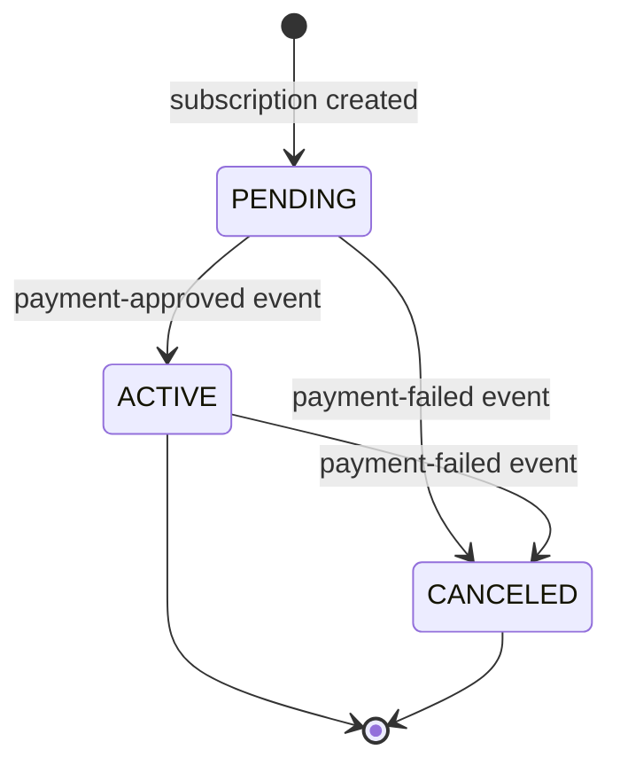

While a customer holds a subscription in `PENDING`, `ACTIVE` or `TRIALING`, the service rejects the creation of a duplicate subscription for the same plan. The status model also defines `PAST_DUE`, `TRIALING` and `INCOMPLETE`, matching Stripe's subscription vocabulary; the active flow uses the three states shown above.

* * *

## End-to-End Flow

A customer subscribes to a plan; Stripe processes the payment; the outcome drives the rest asynchronously. The same flow covers both an approved and a declined payment — the difference is decided entirely by the Stripe test payment method used.

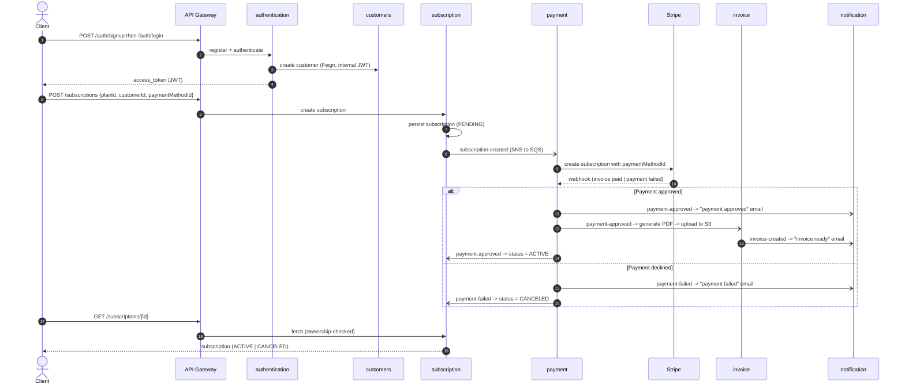

The final `GET /subscriptions/{id}` is the customer accessing the resource they purchased; it is ownership-checked, so a customer can only read their own subscription.

* * *

## Design Patterns

Patterns applied in the codebase (each is used, not aspirational):

| Pattern | Where | Rationale |
|---|---|---|
| Event-driven choreography | SNS → SQS across subscription/payment/invoice/notification | Services react to events independently, with no central orchestrator |
| Compensating action | subscription-service | On `payment-failed`, the pending subscription is canceled — the choreographed compensation for a failed payment |
| Database per service | every persistent service | Data ownership and independent schema evolution (Flyway) |
| API Gateway | api-gateway | Single entry point for routing and JWT validation |
| Service discovery | Eureka | Services resolve each other by logical name |
| Externalized configuration | Config Server (Git-backed) | Central, profile-based config; secrets injected from the environment |
| Circuit breaker + retry | payment-service, Resilience4j on the Stripe subscription call (`name = "stripe"`, with fallback) | Contains and recovers from Stripe failures |
| Dead-letter queue | payment-service | Events that fail processing are forwarded to `payment-processing-dlq` for later inspection |
| Token-based service-to-service auth | Feign `RequestInterceptor` (subscription, authentication) | Each outbound internal call carries a short-lived internal JWT (`SCOPE_INTERNAL_SERVICE`) |
| Strategy / Port–Adapter | notification-service (`SendNotificationPort` / `SendNotificationAdapter`) | Notification delivery is behind a port, so the transport can change without touching callers |

* * *

## Tech Stack

| Category | Technologies |
|---|---|
| Language / runtime | Java 21 |
| Framework | Spring Boot 3.5.0, Spring Cloud 2025.0.0 |
| Cloud patterns | Eureka (discovery), Config Server, Spring Cloud Gateway, OpenFeign |
| Security | Spring Security OAuth2 Resource Server, HMAC256 JWT (Nimbus) |
| Persistence | PostgreSQL per service (AWS RDS), Flyway 10.20.1, Spring Data JPA |
| Messaging | AWS SNS + SQS (AWS SDK v2, `spring-cloud-aws-starter-sqs`); LocalStack for local dev |
| Payments | Stripe (`stripe-java` 26.1.0) + webhooks |
| Documents & email | openhtmltopdf (PDF), AWS S3 (storage), AWS SES (email) |
| Resilience | Resilience4j (circuit breaker + retry) |
| Observability | Micrometer, OpenTelemetry (OTLP), OTel Collector, Prometheus, Loki, Tempo, Grafana |
| Delivery | Docker, Docker Compose, GitHub Actions, Docker Hub, AWS EC2 |

* * *

## Observability

Every service exports metrics, logs and traces in OTLP to a single OpenTelemetry Collector, which is the one ingestion point for the whole pipeline:

```
each service --OTLP--> OpenTelemetry Collector --> Prometheus (metrics)
                                              |--> Loki       (logs)
                                              +--> Tempo      (traces)
                                                        |
                                                        v
                                                     Grafana
```

Trace context is propagated through the SNS/SQS messages, so a single subscription can be followed across services in Tempo, including across the asynchronous boundary. Two Grafana dashboards are provisioned with the stack (`observability/grafana/provisioning/dashboards/`):

- **Golden Signals (RED + Saturation)** — throughput, error rate, latency percentiles, throughput by HTTP status, and saturation (JVM heap, process CPU, live threads) per service.
- **Business Metrics** — signups and logins, subscription lifecycle, plans created, payment outcomes, Stripe webhooks, invoices generated, S3 uploads, emails sent by event and delivery outcome, and SNS/SQS/DLQ throughput.

**Golden Signals (RED + Saturation):**

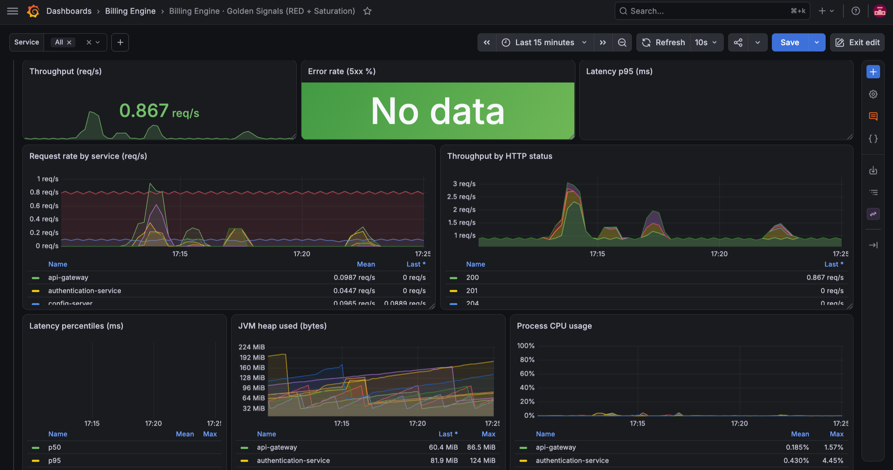

**Business Metrics** — Authentication and Subscription:

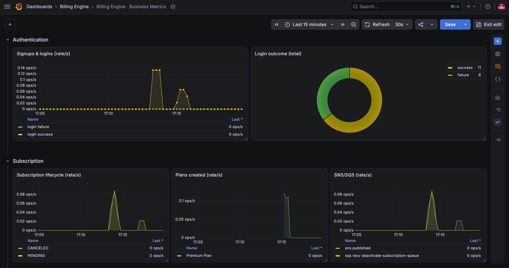

**Business Metrics** — Payment and Notification:

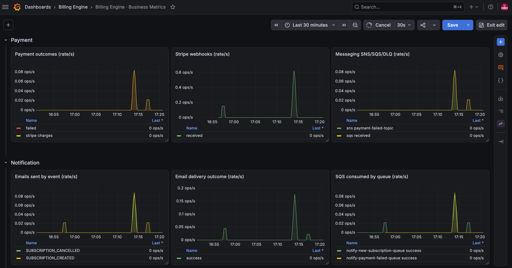

> SCREENSHOT — a single trace in Tempo spanning multiple services (subscription → payment → invoice/notification), to show tracing across the async boundary. Save as `docs/images/tempo-distributed-trace.png`

| Tool | Local URL |
|---|---|
| Grafana | http://localhost:3000 |
| Prometheus | http://localhost:9090 |
| Tempo | http://localhost:3200 |
| Loki | http://localhost:3100 |
| OTel Collector | `:4317` gRPC · `:4318` HTTP · `:8889` Prometheus scrape |

* * *

## Screenshots — Stripe, Emails, Invoice

The four HTML email templates are in `notification-service/src/main/resources/templates/`; the invoice template is `invoice-service/src/main/resources/templates/invoice.html`.

**Stripe (test mode)** — an approved and a declined payment:

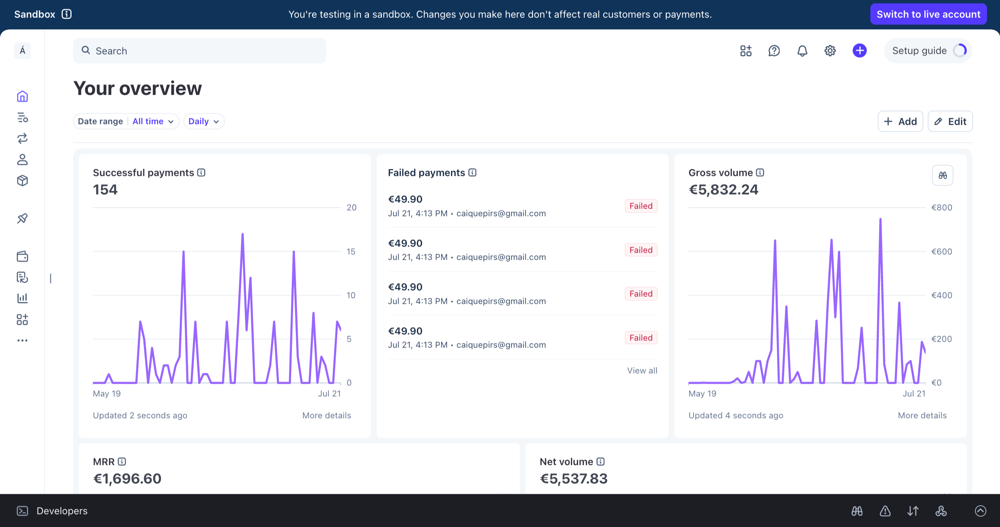

**Transactional emails** — new subscription, payment approved, payment failed, invoice ready:

<table>
  <tr>
    <td width="50%">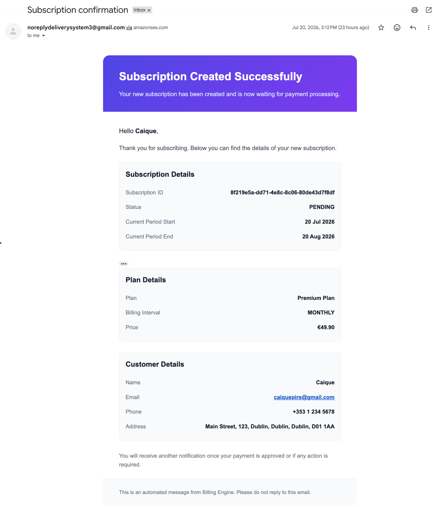<br/><sub><b>New subscription</b></sub></td>
    <td width="50%">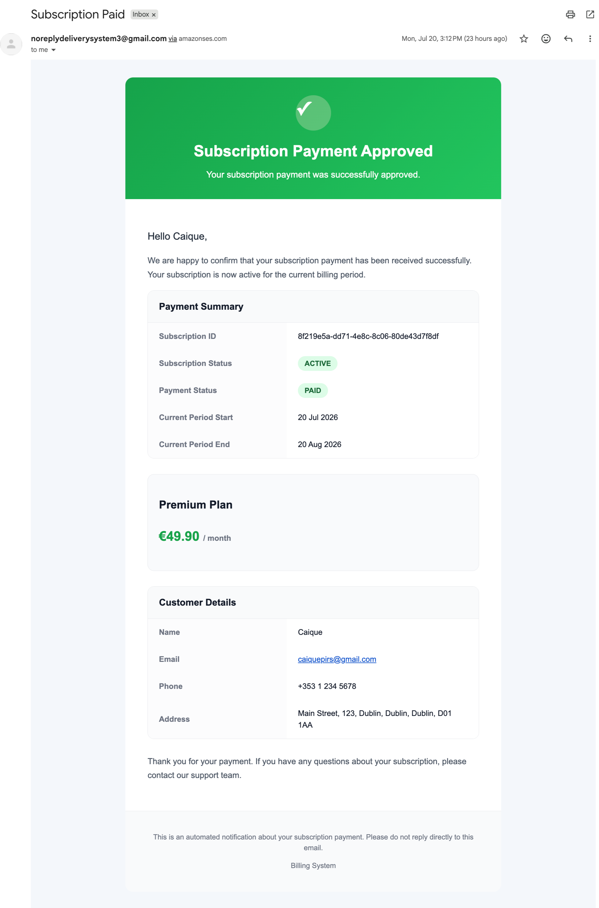<br/><sub><b>Payment approved</b></sub></td>
  </tr>
  <tr>
    <td width="50%">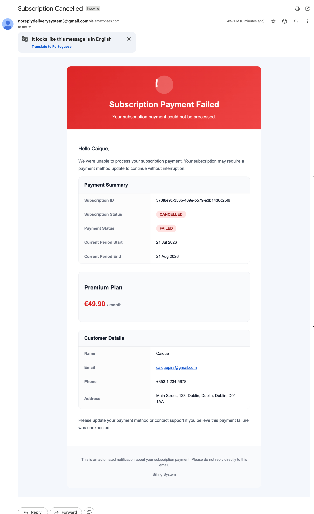<br/><sub><b>Payment failed</b></sub></td>
    <td width="50%">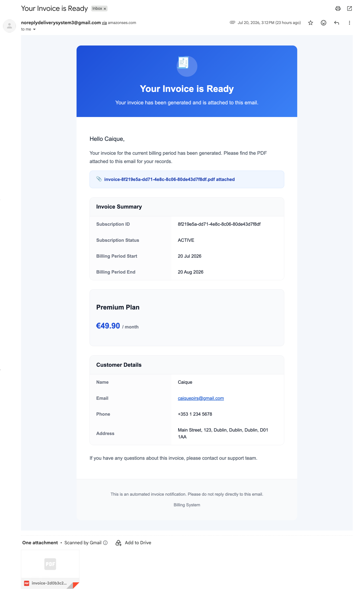<br/><sub><b>Invoice ready</b></sub></td>
  </tr>
</table>

**Generated invoice** — PDF rendered from `invoice.html` and stored in S3:

<p align="center">
  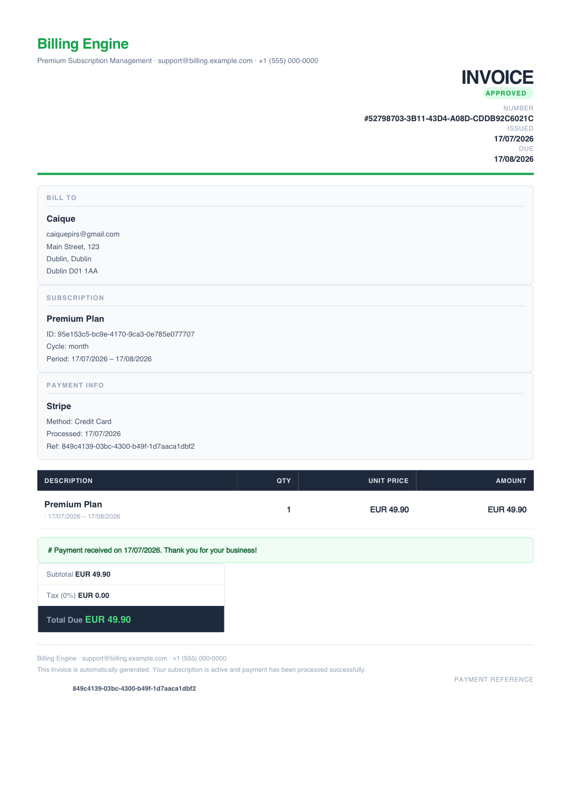
  <br/><sub><a href="docs/images/invoice-generated.pdf">Download the original PDF</a></sub>
</p>

* * *

## Running the Stack

The committed `docker-compose.yml` is the deployment topology: it pulls the published `caiquepirs/*` images from Docker Hub, connects the services to AWS RDS (databases) and real AWS (SNS/SQS/S3/SES), and runs the observability stack locally (Grafana, Prometheus, OTel Collector, Loki, Tempo) plus pgAdmin.

### Prerequisites

- Docker and Docker Compose
- A `.env` file at the repository root (see below)
- For a fully local run without an AWS account: LocalStack, provisioned by `init-aws.sh` (creates the SNS topics, SQS queues and S3 bucket), with the services pointed at the `dev` profile

### 1. Environment variables

Secrets and environment-specific values are injected through `.env` (not committed), grouped as:

| Group | Variables |
|---|---|
| Databases | `*_SERVICE_URL_DATABASE`, `BILLING_ENGINE_DB_USER`, `BILLING_ENGINE_DB_PASSWORD` |
| Security | `SECRET_KEY` (shared HMAC256 JWT key) |
| Service credentials | `AUTHENTICATION_SERVICE_CLIENT_ID/SECRET`, `SUBSCRIPTION_SERVICE_CLIENT_ID/SECRET` |
| AWS | `AWS_REGION`, `AWS_URI`, `AWS_ACCESS_KEY`, `AWS_SECRET_KEY`, `AWS_S3_BUCKET` |
| Topics / queues | `*_TOPIC`, `*_QUEUE` |
| Stripe | `STRIPE_SECRET_KEY`, `STRIPE_WEBHOOK_SIGN` |
| Observability | `OTLP_METRICS_EXPORT_URL`, `OTLP_LOGGING_EXPORT_URL`, `OTLP_TRACING_EXPORT_URL` |
| Platform | `SPRING_PROFILES_ACTIVE`, `CONFIG_SERVER_URL`, `EUREKA_ZONE_URL` |

The full, annotated list is documented in the configuration repository: [billing-engine-config-service](https://github.com/CaiquePirs/billing-engine-config-service).

### 2. Start the stack

```bash
# config-server and eureka become healthy first, then the rest start
docker compose up -d

# follow logs
docker compose logs -f api-gateway
```

Startup is ordered: every service `depends_on` `config-service` and `eureka-service` reporting healthy, so no service boots before its configuration source is reachable.

### 3. (Local only) provision AWS resources on LocalStack

```bash
# creates 3 SNS topics, 8 SQS queues + a DLQ, and the S3 bucket
./init-aws.sh
```

### Endpoints

| Component | URL |
|---|---|
| API Gateway (entry point) | http://localhost:8080 |
| Eureka dashboard | http://localhost:8761 |
| Config Server | http://localhost:8888 |
| Grafana | http://localhost:3000 |
| pgAdmin | http://localhost:5050 |

### Build a single service from source

```bash
cd subscription-service
mvn clean package -DskipTests   # build
mvn spring-boot:run             # run
mvn test                        # tests
```

* * *

## API Walkthrough

All requests go through the gateway at `http://localhost:8080`.

**1. Sign up (public).** Registers the auth user and creates the matching customer (through an internal Feign call to `customers-service`).

```bash
curl -X POST http://localhost:8080/api/v1/auth/signup \
  -H "Content-Type: application/json" \
  -d '{
    "name": "Jane", "lastName": "Doe",
    "email": "jane.doe@example.com", "password": "S3curePass!",
    "phone": "+353830000000", "taxNumber": "IE1234567T",
    "dateOfBirth": "1990-05-20", "role": "CUSTOMER",
    "address": { "street": "O'\''Connell Street", "number": "12",
      "city": "Dublin", "state": "Leinster", "county": "Dublin", "eircode": "D01F5P2" }
  }'
```

**2. Log in and get a JWT.**

```bash
curl -X POST http://localhost:8080/api/v1/auth/login \
  -H "Content-Type: application/json" \
  -d '{ "email": "jane.doe@example.com", "password": "S3curePass!" }'
# -> { "access_token": "eyJhbGciOiJIUzI1NiJ9..." }
```

**3. Subscribe to a plan** (`ROLE_CUSTOMER`). Persists the subscription as `PENDING` and publishes `subscription-created`; the asynchronous flow takes over from here.

```bash
curl -X POST http://localhost:8080/api/v1/subscriptions \
  -H "Authorization: Bearer $TOKEN" -H "Content-Type: application/json" \
  -d '{ "planId": "<PLAN_UUID>", "customerId": "<CUSTOMER_UUID>", "paymentMethodId": "pm_card_visa" }'
```

**4. Access the purchased subscription** (`ROLE_CUSTOMER`).

```bash
curl http://localhost:8080/api/v1/subscriptions/<SUBSCRIPTION_UUID> \
  -H "Authorization: Bearer $TOKEN"
# -> subscription with status ACTIVE (approved) or CANCELED (declined)
```

Plans (`POST /api/v1/plans`) are created under the internal `SCOPE_INTERNAL_SERVICE` scope (the call also creates the corresponding Stripe product/price), so plan IDs are seeded ahead of the customer flow.

Model enums: `IntervalPlan` = `MONTHLY | YEARLY` · `SubscriptionStatus` = `PENDING | ACTIVE | CANCELED | PAST_DUE | TRIALING | INCOMPLETE` · `PaymentStatus` = `PENDING | APPROVED | FAILED` · `Role` = `CUSTOMER | TENANT`.

* * *

## Testing Payments — Approved and Declined

The subscribe request carries a Stripe test payment method ID, which deterministically drives the outcome. Use Stripe test-mode keys.

| Outcome | `paymentMethodId` | Result |
|---|---|---|
| Approved | `pm_card_visa` | Payment succeeds → `payment-approved-topic` → invoice + emails + subscription `ACTIVE` |
| Declined (generic) | `pm_card_chargeDeclined` | Declined → `payment-failed-topic` → failed email + subscription `CANCELED` |
| Insufficient funds | `pm_card_chargeDeclinedInsufficientFunds` | Declined variant |
| Lost card | `pm_card_chargeDeclinedLostCard` | Declined variant |

To demonstrate the full flow:

1. Subscribe with `pm_card_visa` — observe the payment-approved email, the invoice-ready email, the generated PDF in S3, and `GET /subscriptions/{id}` returning `ACTIVE`.
2. Subscribe again with `pm_card_chargeDeclined` — observe the payment-failed email and the subscription ending in `CANCELED`.
3. Open Grafana to see both runs on the business-metrics dashboard, and Tempo to follow a single request across all services.

These are Stripe's shared test tokens — see the [Stripe testing docs](https://docs.stripe.com/testing). Do not use live keys.

* * *

## CI/CD and Deployment

Each service has its own GitHub Actions workflow in `.github/workflows/`, path-filtered so that only the changed service rebuilds in this monorepo. Every pipeline runs on a self-hosted runner on AWS EC2 and has two stages:

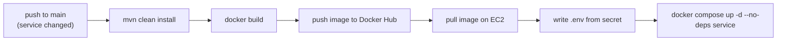

- **Build** — checkout, JDK 21 (Temurin, Maven cache), `mvn clean install`, `docker build`, push `caiquepirs/<service>` to Docker Hub.
- **Deploy** — on the EC2 runner: pull the fresh image, write `.env` from the `DOCKER_ENV_FILE` secret, and roll only the affected container with `docker compose up -d --no-deps <service>` (followed by an image prune).

The system is deployed and has been validated end-to-end on EC2 with Postman (approved and declined payment flows).

* * *

## Repository Structure

```
billing-engine-microservices/
├── api-gateway/                 # Spring Cloud Gateway (edge, :8080)
├── eureka-service/              # Service registry (:8761)
├── config-service/              # Config Server (:8888)
├── authentication-service/      # JWT issuance, signup, internal tokens
├── customers-service/           # Customer CRUD + Stripe customer
├── subscription-service/        # Plans + subscription lifecycle + Stripe
├── payment-service/             # Stripe webhooks + payment processing + Resilience4j
├── invoice-service/             # PDF invoices (openhtmltopdf) + S3
├── notification-service/        # Transactional emails via AWS SES
├── observability/               # OTel Collector, Prometheus, Loki, Tempo, Grafana dashboards
├── docs/images/                 # README screenshots (see checklist)
├── init-aws.sh                  # LocalStack: SNS topics + SQS queues + S3 bucket
├── docker-compose.yml           # Full stack (images + observability + pgAdmin)
└── architecture-*.png           # Architecture and flow diagrams
```

Configuration lives in a separate repository: [billing-engine-config-service](https://github.com/CaiquePirs/billing-engine-config-service) (`dev/` and `prod/` profiles).

* * *

## Screenshot Checklist

Images embedded so far (in `docs/images/`). Only one capture is still missing:

- [x] C4 container diagram — `architecture(c4)-billing-engine.png`
- [x] Golden Signals dashboard — `golden-signals-metrics.png`
- [x] Business Metrics dashboard — `billing-dashboards-metrics.png` (top) + `billing-dashboard-metrics.png` (bottom)
- [ ] Tempo distributed trace — `tempo-distributed-trace.png` *(still to capture)*
- [x] Stripe dashboard — `stripe-dashboards.png`
- [x] New subscription email — `email-confirmation-subscription.png`
- [x] Payment approved email — `email-payment-approved.png`
- [x] Payment failed email — `email-payment-failed.png`
- [x] Invoice ready email — `email-invoice-created.png`
- [x] Generated invoice — `invoice-generated.png` (converted from `invoice-generated.pdf`)

The Mermaid diagrams above render natively on GitHub — no image needed for those.

* * *

## Roadmap

- [ ] Per-service `README.md` (endpoints, data model, events, configuration) for the six business services
- [ ] Update the UML class diagram to match the current model
- [ ] Add a `LICENSE` file
- [ ] Capture and embed the screenshots listed above
- [ ] Record an end-to-end demo (approved and declined payment)

* * *

**Author** — Caique Pires. Building distributed systems with Java, Spring and AWS.
