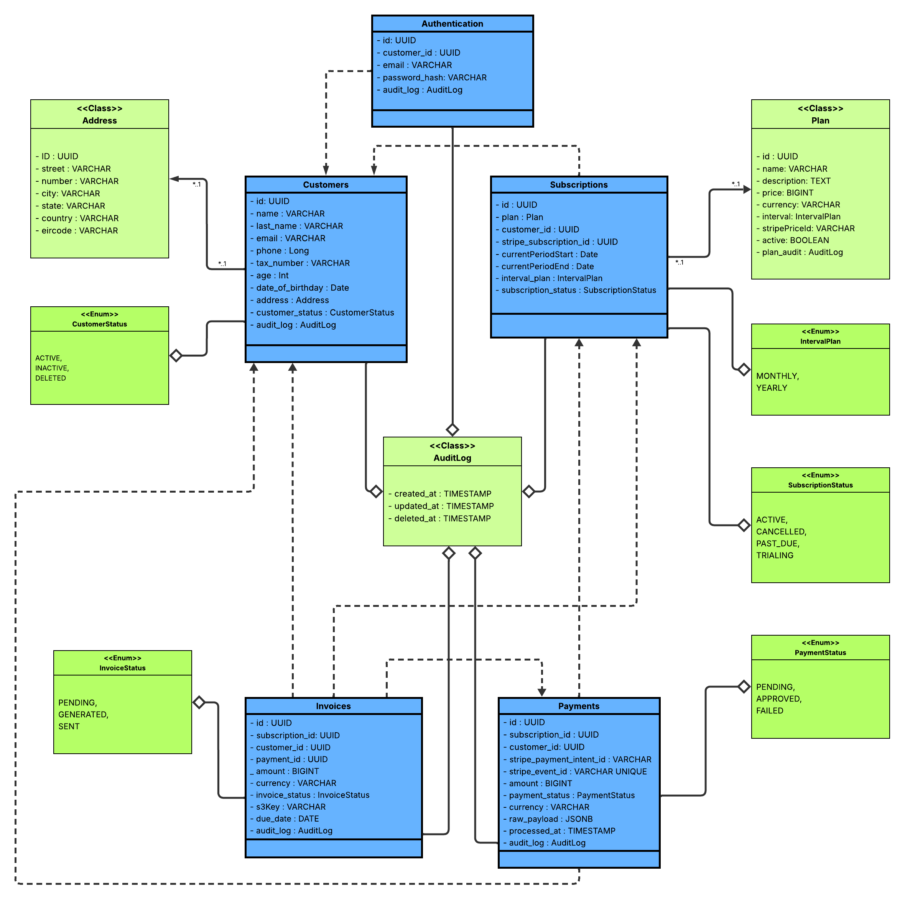

## 🚀 Architecture of the billing engine built using C4 model-level containers
-billing-engine.png)

## 🚀 Complete architecture of the billing engine's success workflow

### 🚀 Entity diagram UML and of the billing engine.

